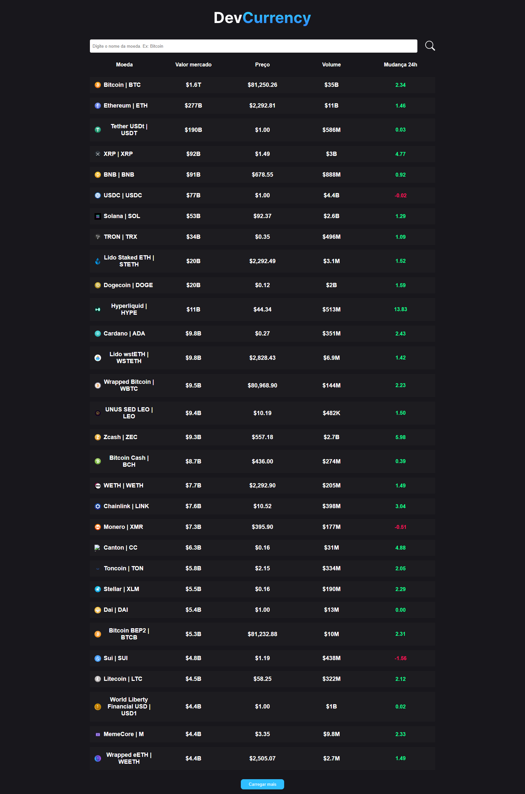
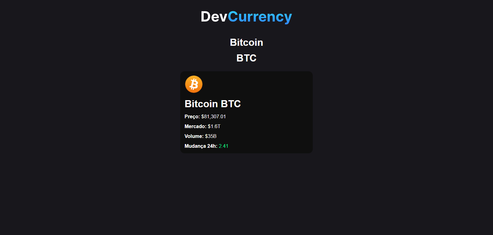

🚀 CryptoApp

- Aplicação web desenvolvida em React + TypeScript para visualização de criptomoedas em tempo real utilizando a API da CoinCap.

- O projeto permite navegar entre ativos, visualizar detalhes específicos de cada criptomoeda e carregar novos resultados dinamicamente através de paginação.

📸 Preview

  

  

  
  

🛠️ Tecnologias utilizadas
- React
- TypeScript
- Vite
- React Router DOM
- CSS Modules
- CoinCap API

⚡ Funcionalidades

✅ Listagem dinâmica de criptomoedas
✅ Paginação utilizando offset
✅ Botão “Carregar mais”
✅ Página de detalhes para cada moeda
✅ Rotas dinâmicas com React Router
✅ Formatação de valores monetários
✅ Tratamento de rotas inválidas
✅ Responsividade
✅ Componentização da interface

🧠 Conceitos praticados

Durante o desenvolvimento do projeto foram aplicados conceitos importantes do ecossistema React:

- useState
- useEffect
- Rotas dinâmicas
- Consumo de API REST
- Paginação com offset
- Manipulação de estados
- Tipagem com TypeScript
- Imutabilidade
- Componentização
- CSS Modules
- Renderização dinâmica
- Formatação de dados

🔗 API utilizada
CoinCap API

📈 Aprendizados

Este foi meu primeiro projeto desenvolvido utilizando TypeScript com React.

O principal objetivo foi consolidar conceitos importantes como:
- tipagem de estados e propriedades
- consumo de APIs
- rotas dinâmicas
- paginação
- componentização
- manipulação de dados

Durante o desenvolvimento, consegui aprofundar meus conhecimentos em React moderno e melhorar minha organização de código utilizando TypeScript.